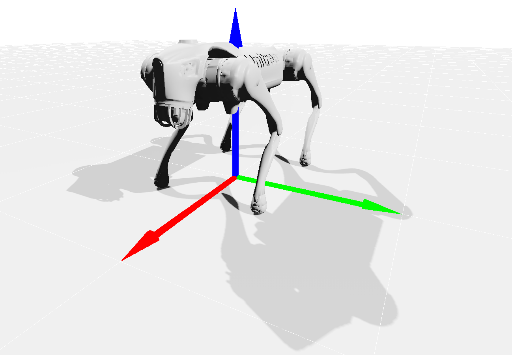
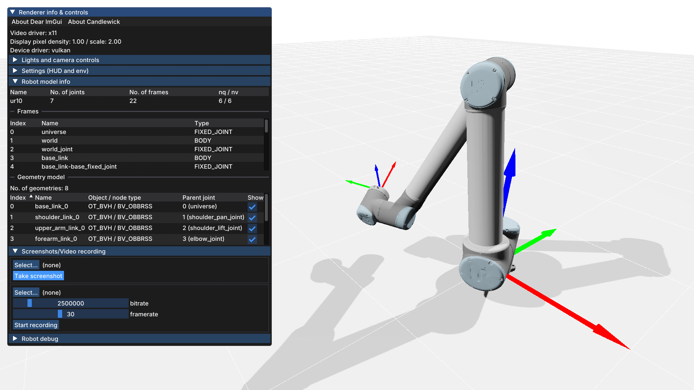

[](https://results.pre-commit.ci/latest/github/Simple-Robotics/candlewick/main)
[](https://anaconda.org/conda-forge/candlewick)


# Candlewick: a modern, cross-platform real-time renderer for robotics based on SDL3

> [!WARNING]
> Candlewick is still under **active** development. Support will be limited, and the API might break unexpectedly and repeatedly.


Candlewick is a cross-platform framework for real-time visualization in robotics, based on SDL3's [graphics API](https://wiki.libsdl.org/SDL3/CategoryGPU).



## Features

### Graphical features

* Shadow mapping using directional shadow maps
* Screen-space ambient occlusion (SSAO)
* **WIP:** Screen-space shadows (SSS)

### Interactivitity

* Integration with ImGui
* Take screenshots of the main window
* **(optional)** Record videos from the main window using FFmpeg

### Pinocchio visualizer

Candlewick visualization utilities for robotics based on Pinocchio.

You can load a Pinocchio model, its geometry model, and create a visualizer that can be used similar to the other visualizers included in `pinocchio.visualize`.
Here's a Python example:

```python
import example_robot_data as erd
import pinocchio as pin
from candlewick import Visualizer, VisualizerConfig, create_recorder_context

robot = erd.load("ur10")
model: pin.Model = robot.model
visual_model: pin.GeometryModel = robot.visual_model

config = VisualizerConfig()
config.width = 1280
config.height = 720
viz = Visualizer(config, model, visual_model)

q0 = pin.neutral(model)
viz.addFrameViz(model.getFrameId("tool0"))

with create_recorder_context(viz, "ur10_video.mp4"):
  while not viz.shouldExit:
    viz.display(q0)
```



#### Candlewick visualizer runtime and client

The runtime allows users to persist a visualizer window and keep interacting with it asynchronously, *even when display commands are not being submitted*.

To build the runtime, users must set the `BUILD_VISUALIZER_RUNTIME` CMake option.

Launch the candlewick runtime:

```bash
candlewick-visualizer # --help
```

The corresponding asynchronous visualizer client is used as follows:

```python
from candlewick.async_visualizer import AsyncVisualizer

viz = AsyncVisualizer(model, geom_model)
viz.initViewer(hostname="127.0.0.1", port=12000)
viz.loadViewerModel()
# use as any other Pinocchio visualizer class
```

Check out the [corresponding example](examples/python/ur3_async_runtime.py).


## Dependencies

### Core dependencies

Candlewick depends mainly on:

* [SDL3](https://github.com/libsdl-org/SDL/) - Graphics backend, windowing, user input
* [Assimp](https://assimp-docs.readthedocs.io/en/latest/) - Loading meshes and importing 3D assets
* [EnTT](https://github.com/skypjack/entt/) - Implementing the Entity-Component System
* [nlohmann_json](https://github.com/nlohmann/json) - JSON parsing (used internally for shader reflection)
* [Eigen](https://gitlab.com/libeigen/eigen/) - Linear algebra
* [Coal](https://github.com/coal-library/coal) - Collision detection, geometry primitives
* [magic_enum](https://github.com/Neargye/magic_enum) - Enum reflection utilities

These dependencies can be installed from Conda as follows:
```bash
conda install -c conda-forge sdl3 eigen coal magic_enum assimp entt nlohmann_json
```

Additionally, candlewick depends on the following bundled dependencies:

* [ImGui](https://github.com/ocornut/imgui/) - immediate-mode GUI

### Optional dependencies

#### Python bindings

* [eigenpy](https://github.com/stack-of-tasks/eigenpy) for Python bindings.

*Python runtime dependencies:* `numpy`

#### Pinocchio support

Required for the `candlewick::multibody` classes and functions:

* [Pinocchio](https://github.com/stack-of-tasks/pinocchio), **must** be built with collision support.
  `conda install -c conda-forge pinocchio`

*Python runtime dependencies:* `pinocchio` (Python bindings)

Additional dependencies for the `candlewick-visualizer` runtime:

* [cppzmq](https://github.com/zeromq/cppzmq) - C++ ZeroMQ bindings
* [msgpack-cxx](https://github.com/msgpack/msgpack-c/tree/cpp_master) - MessagePack serialization

*Python runtime dependencies:* `pyzmq msgspec`

#### Video recording

* [FFmpeg](https://ffmpeg.org/) for support for recording videos from the rendered graphics. | `conda install ffmpeg pkg-config` | The following components are required:
  * `libavformat` - Container format handling
  * `libavcodec` - Video encoding/decoding
  * `libswscale` - Image scaling and format conversion

#### Development dependencies (tests, examples)

* [GoogleTest](https://github.com/google/googletest) for the tests | `conda install gtest`
* [CLI11](https://github.com/CLIUtils/CLI11) for the examples and tests | `conda install cli11`
* <u>With Pinocchio support</u>: building the C++ examples requires [example-robot-data](https://github.com/Gepetto/example-robot-data).
  `conda install -c conda-forge example-robot-data`

## Building Candlewick

For building the library, you will need [CMake](https://cmake.org/) (version at least 3.26) and a C++20-compliant compiler. These can also be obtained through Conda.

In the directory where you have checked out the code, perform the following steps:
```bash
# 1. Create a CMake build directory
cmake -S . -B build/ \
  -DCMAKE_BUILD_TYPE=Release \
  -DBUILD_PINOCCHIO_VISUALIZER:BOOL=ON \  # For Pinocchio support
  -DBUILD_VISUALIZER_RUNTIME:BOOL=ON \  # Async visualizer runtime
  -DBUILD_PYTHON_INTERFACE:BOOL=ON \  # For Python bindings
  -DGENERATE_PYTHON_STUBS:BOOL=ON \  # Python binding type stubs
  -GNinja \ # or -G"Unix Makefiles" to use Make
  -DBUILD_TESTING=OFF \  # or ON not build the tests
  -DCMAKE_INSTALL_PREFIX=<your-install-prefix> \  # e.g. ~/.local/, or $CONDA_PREFIX
  <other-options...>
# 2. Move into it and build (generator-independent)
cd build/
cmake --build . -j<num-parallel-jobs>
# 3. Install
cmake --install .
```

### A summary of build options

| Build Option | Default | Description | Additional Dependencies | Requires |
|-------------|---------|-------------|------------------------|----------|
| `BUILD_PYTHON_INTERFACE` | `ON` | Build Python bindings | eigenpy | - |
| `BUILD_PINOCCHIO_VISUALIZER` | `ON` | Enable Pinocchio robot visualization | pinocchio >= 3.5 | - |
| `BUILD_VISUALIZER_RUNTIME` | `OFF` | Build `candlewick-visualizer` executable | cppzmq, msgpack-cxx | `BUILD_PINOCCHIO_VISUALIZER=ON` |
| `BUILD_WITH_FFMPEG_SUPPORT` | `OFF` | Enable video recording capabilities | FFmpeg | - |
| `GENERATE_PYTHON_STUBS` | `OFF` | Generate Python type stubs | *(handled by cmake submodule)* | `BUILD_PYTHON_INTERFACE=ON` |


## Credits

Many of the design choices of this library are heavily inspired by other, more mature work in the open-source 3D graphics middleware space.

Here are some of the resources I've looked at:

* the [Magnum](https://magnum.graphics/) graphics middleware (the design ideas around mesh layouts, how to load geometry primitives, and the type-erased `MeshData` type)
* [bgfx](https://github.com/bkaradzic/bgfx/)
* Sascha Willems' Vulkan examples: https://github.com/SaschaWillems/Vulkan/


### Font Credit/License

Candlewick embeds the **Inter Medium** font as part of its source code:

**Inter-Medium.ttf**, by Rasmus Andersson.  
SIL OPEN FONT LICENSE Version 1.1  
Copyright (c) 2016 The Inter Project Authors  
https://rsms.me/inter
